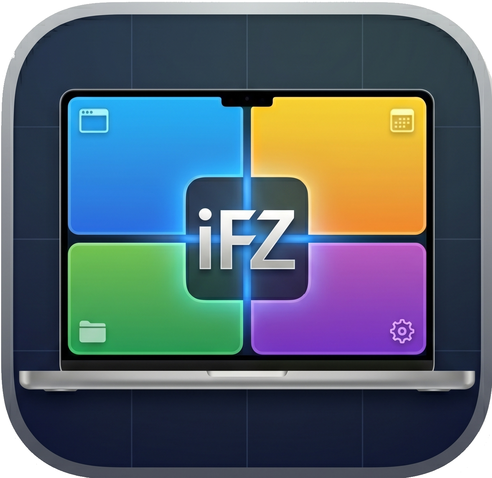
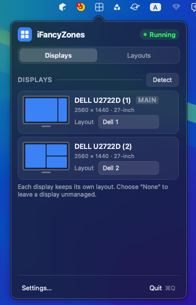
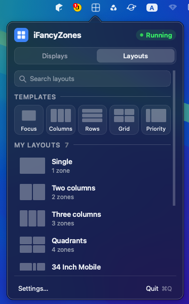
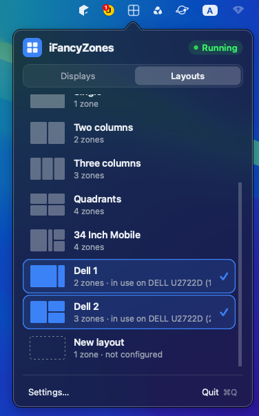
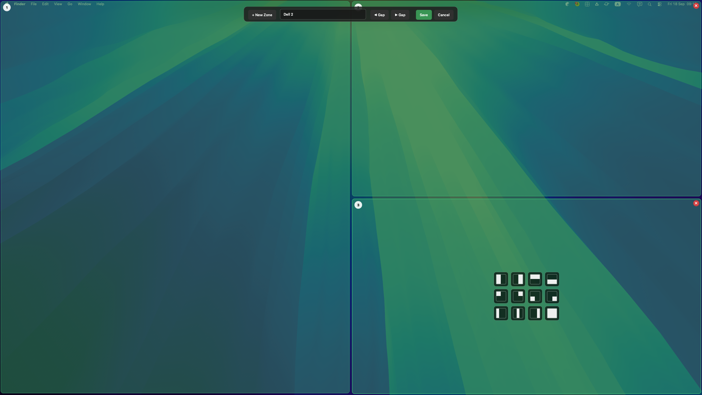

<div align="center">



# iFancyZones

**Zone-based window management for macOS.**
Draw your own layouts, then snap any window into place with a drag and a keypress.

Inspired by Microsoft PowerToys FancyZones, rebuilt natively for macOS with Qt 6 and Objective-C++.

[](#version--author)
[](#requirements)
[](#third-party-libraries)
[](#build-from-source)
[](LICENSE)

</div>

---

## Table of contents

- [Highlights](#highlights)
- [Screenshots](#screenshots)
- [How it works](#how-it-works)
- [Requirements](#requirements)
- [Installation](#installation)
- [Keyboard shortcuts](#keyboard-shortcuts)
- [Settings](#settings)
- [Layouts and data](#layouts-and-data)
- [Architecture](#architecture)
- [Build from source](#build-from-source)
- [Third-party libraries](#third-party-libraries)
- [Roadmap](#roadmap)
- [Changelog](#changelog)
- [License](#license)
- [Version & author](#version--author)

---

## Highlights

| | |
|---|---|
| **Menu-bar only** | Runs as an `LSUIElement` agent. No Dock icon, no window clutter. One click on the tray icon opens the popover. |
| **Drag-to-snap** | Grab a window, hold the activation key (default `Space`), the zone overlay appears, drop the window and it snaps. |
| **Free-form editor** | Full-screen canvas per display. Create, drag, resize and delete zones anywhere. No fixed grid. |
| **12 preset alignments** | Each zone offers a centered 4x3 grid of hand-painted thumbnails: halves, thirds, quadrants, full. One click aligns it. |
| **Adjustable gaps** | Live `Gap +` / `Gap -` in the editor toolbar. Zones shrink visually as you tune the spacing. |
| **True multi-monitor** | Every display binds to its own layout via `CGDisplayUnitNumber`, stable across reconnects. Identical monitors stay independent. |
| **Detect displays** | A giant numbered badge flashes on every physical screen for 3 seconds so you always know which row is which. |
| **Cycle within a zone** | Multiple windows sharing one zone? A hotkey (default `Opt+Tab`) rotates which one is on top. |
| **3D app switcher** | An optional carousel overlay (default `Opt+Space`). Hold the modifier, navigate with the arrow keys, release to raise. |
| **Templates & search** | Five starter templates (Focus, Columns, Rows, Grid, Priority) plus live search across your own layouts. |
| **Guided permissions** | First launch prompts for Accessibility and a 2-second watchdog re-installs the event tap the moment you grant it. No restart. |
| **Self-contained bundle** | `macdeployqt` embeds the Qt frameworks, so the DMG runs on machines with no Qt installed. |

---

## Screenshots

### Displays tab: one layout per screen

Each connected display gets its own row with a live thumbnail, resolution, physical size and the layout bound to it. `Detect` flashes the index on the physical screens.

<p align="center"></p>

### Layouts tab: templates and your own library

Start from a template or browse your library. Every row shows the zone count, and layouts currently in use are highlighted with the display they are bound to.

<p align="center">
  
  &nbsp;&nbsp;
  
</p>

### Layout editor: draw zones directly on the screen

The editor takes over the display it belongs to. The floating toolbar carries `+ New Zone`, an inline editable layout name, gap controls, and `Save` / `Cancel`. Each zone shows its index badge, a delete button, and the 4x3 preset grid when it is large enough.

<p align="center"></p>

---

## How it works

```
   You drag a window                    You press the activation key
          |                                          |
          v                                          v
   CGEventTap on the HID stream  ---->  DragDetector  ---->  ZoneOverlay appears
          |                                                        |
          |  (mouse up over a zone)                                |
          v                                                        v
   WindowManager resolves display -> layout -> zone     LayoutEngine hit-test
          |
          v
   AccessibilityBridge (AXUIElement) sets the window frame
```

- **Activation is gated** by a key you choose, so ordinary drags are never hijacked.
- **The dragged window is captured at mouse-down**, not at drop time, so a focus change mid-drag cannot move the wrong window.
- **The frame is applied twice** (immediately, then again after 90 ms) to beat the macOS drag-finalize race that would otherwise undo the snap.
- **Hit-testing uses the outer zone rect**, ignoring the visual gap, so the whole zone stays clickable.

---

## Requirements

| | |
|---|---|
| macOS | 12.0 Monterey or newer |
| Architecture | Apple Silicon (`arm64`); the project also builds `x86_64` |
| Permission | Accessibility (required to move and resize other apps' windows) |

The app is **not** sandboxed and therefore not distributed through the Mac App Store: cross-process Accessibility is incompatible with App Sandbox.

---

## Installation

### From a release DMG

1. Download the latest `iFancyZones-<version>.dmg` from the Releases page.
2. Open it and drag **iFancyZones** into `Applications`.
3. Builds are ad-hoc signed and not notarized, so Gatekeeper will complain on first open. Right-click the app, choose **Open**, then **Open** again.
4. Grant **System Settings -> Privacy & Security -> Accessibility -> iFancyZones**. The app detects the change within 2 seconds. No restart needed.

### Uninstall

Delete `/Applications/iFancyZones.app` and, optionally, `~/Library/Application Support/iFancyZones/`.

---

## Keyboard shortcuts

| Action | Default | Configurable |
|---|---|---|
| Show zone overlay while dragging | `Space` (held) | Yes, any single key or modifier |
| Cycle windows inside the current zone | `Opt+Tab` | Yes, modifier + key |
| Open the 3D app-switcher carousel | `Opt+Space` | Yes, modifier + key, and can be disabled |
| Navigate the carousel | Arrow keys | No |
| Commit the carousel selection | Release the modifier | No |
| Quit | `Cmd+Q` from the popover | No |

`Cmd+Tab` is deliberately avoided for cycling because it collides with the system app switcher.

---

## Settings

Reachable from **Settings...** in the popover footer.

- Snap activation key
- Cycle-window-in-zone chord
- App switcher (3D carousel) chord
- Launch at login
- Default zone gap
- Show zone numbers during the snap preview
- Restore the original size when unsnapping
- About block with icon, version, author and copyright

---

## Layouts and data

Five built-in templates ship with the app: **Focus**, **Columns**, **Rows**, **Grid** and **Priority**. The default library adds **Single**, **Two columns**, **Three columns** and **Quadrants**. Built-in layouts cannot be edited or deleted, but they can be duplicated and then customised.

Everything persists as JSON:

```
~/Library/Application Support/iFancyZones/data.json
```

The file carries `schema-version`, the layout list (zones as normalised rectangles), the per-display bindings keyed by stable unit number, and the settings block. It is plain text, so it can be versioned or copied between machines.

---

## Architecture

Strict layering keeps the Apple-specific code in one place:

```
src/iFancyZones/
├── main.cpp
├── core/            Pure C++/Qt, no platform code, unit-testable anywhere
│   ├── Zone         Normalised rectangle + index
│   ├── Layout       Named collection of zones + gap
│   ├── Monitor      Display identity and the stable key
│   └── LayoutEngine Hit-testing and geometry resolution
├── services/        Orchestration between core/ and platform/
│   ├── SettingsStore  JSON persistence, layout CRUD, bindings
│   ├── AppSettings    Settings value type
│   └── WindowManager  Drag lifecycle, snapping, zone cycling
├── app/             Lifecycle and wiring
│   ├── Application  Bootstrap, permissions, single instance
│   ├── TrayController Menu-bar item and popover anchoring
│   └── AppSwitcher  Carousel coordination
├── ui/              Qt Widgets only, zero Apple headers
│   ├── TrayPopover, ScreenLayoutTab, LayoutsTab
│   ├── LayoutEditor, EditorToolbar, ZoneEditorWidget
│   ├── ZoneOverlay, CarouselOverlay, ScreenNumberBadge
│   ├── SettingsWindow, HotkeyEdit, ChordEdit
│   └── PopoverTheme, PopoverWidgets
├── platform/mac/    The only Objective-C++ (.mm), the only Apple imports
│   ├── AccessibilityBridge  AXUIElement read/write, window raising
│   ├── DragDetector         CGEventTap on the HID stream
│   ├── AppKitBridge         NSWindow levels, popover and editor chrome
│   ├── MacScreenInfo        NSScreen enumeration, coordinate conversion
│   ├── HotkeyManager        Carbon RegisterEventHotKey wrapper
│   ├── AppSwitcherBridge    Running-application list and activation
│   └── SwitcherInput        Transient tap while the carousel is open
├── packaging/       Info.plist.in, entitlements.plist, iFancyZones.icns
└── resources/       iFancyZones.qrc
```

Rules enforced across the tree:

- `core/` never includes Qt GUI or Apple headers.
- `ui/` never imports `AppKit`, `ApplicationServices` or `Carbon`. It talks to the platform layer through plain C++ interfaces.
- `platform/mac/` is the sole owner of Apple API calls and is compiled with `-fobjc-arc`.

---

## Build from source

**Prerequisites**

- Qt 6.5 or newer for macOS with the `Core`, `Gui`, `Widgets` and `Svg` modules (developed against 6.11.1)
- CMake 3.21 or newer and Ninja (both ship with the Qt online installer)
- Xcode command-line tools for the Clang toolchain and `codesign`

**Debug build**

```bash
cmake -S src/iFancyZones -B build -G Ninja \
      -DCMAKE_BUILD_TYPE=Debug \
      -DCMAKE_PREFIX_PATH="$HOME/Qt/6.11.1/macos"
cmake --build build --target iFancyZones
open build/iFancyZones.app
```

**Release DMG**

```bash
./package-dmg.sh
```

The script configures a Release build, runs `macdeployqt` to embed the Qt frameworks, verifies that no Homebrew or Qt-install paths remain in the binary, ad-hoc signs the bundle with the entitlements, and produces `releases/iFancyZones-<version>.dmg` with an `/Applications` symlink and the app icon as the volume icon.

Override the defaults with environment variables:

```bash
QT_PREFIX=/path/to/Qt/6.11.1/macos \
CODESIGN_IDENTITY="Developer ID Application: Your Name (TEAMID)" \
VERSION=1.4.1 \
./package-dmg.sh
```

The version is read from `project(iFancyZones VERSION x.y.z)` in `CMakeLists.txt` and reaches the running app through the `IFZ_VERSION` compile definition, so CMake stays the single source of truth.

---

## Third-party libraries

No vendored dependencies, no package manager. The app links only Qt and the system frameworks.

### Runtime dependencies

| Library / framework | Version | Licence | Used for |
|---|---|---|---|
| [Qt 6 Core](https://doc.qt.io/qt-6/qtcore-index.html) | 6.5+ | LGPLv3 / GPLv3 / Commercial | Object model, signals and slots, JSON, timers, `QUuid`, `QStandardPaths` |
| [Qt 6 Gui](https://doc.qt.io/qt-6/qtgui-index.html) | 6.5+ | LGPLv3 / GPLv3 / Commercial | `QPainter` rendering, `QScreen`, icons, pixmaps, gradients |
| [Qt 6 Widgets](https://doc.qt.io/qt-6/qtwidgets-index.html) | 6.5+ | LGPLv3 / GPLv3 / Commercial | The entire UI: popover, tabs, editor, settings, tray icon |
| [Qt 6 Svg](https://doc.qt.io/qt-6/qtsvg-index.html) | 6.5+ | LGPLv3 / GPLv3 / Commercial | Vector icon rendering |
| Apple **AppKit** | macOS 12+ SDK | Apple system framework | `NSWindow` levels, `NSScreen`, popover and overlay chrome, running applications |
| Apple **ApplicationServices** | macOS 12+ SDK | Apple system framework | Accessibility API (`AXUIElement`), trust checks, window frames |
| Apple **Carbon** | macOS 12+ SDK | Apple system framework | `RegisterEventHotKey` for global hotkeys |
| Apple **CoreGraphics** | macOS 12+ SDK | Apple system framework | `CGEventTap` drag detection, `CGDisplay*` identity, window list |
| Apple **QuartzCore** | macOS 12+ SDK | Apple system framework | Layer-backed overlay compositing |
| Apple **Foundation** / **CoreFoundation** | macOS 12+ SDK | Apple system framework | Core Objective-C and CF types across the bridges |
| Apple **ServiceManagement** | macOS 12+ SDK | Apple system framework | Launch-at-login registration |

Qt is dynamically linked and redistributed inside the app bundle under the terms of the **LGPLv3**.

### Build-time tooling

| Tool | Role |
|---|---|
| CMake 3.21+ | Build system, `qt_add_executable`, bundle properties |
| Ninja | Build driver |
| Qt `moc` / `rcc` | Meta-object and resource compilation via `qt_standard_project_setup()` |
| `macdeployqt` | Embeds the Qt frameworks and rewrites install names |
| `codesign` | Ad-hoc or Developer ID signing with the hardened runtime |
| `hdiutil` | DMG creation and compression |
| Clang (Xcode) | C++20 and Objective-C++20 with ARC |

---

## Roadmap

- [ ] App-zone history: a new window of a known app auto-snaps to its last zone
- [ ] Honour the `excludedBundles` list in `WindowManager` and re-enable its UI
- [ ] Snap animation driven by `QVariantAnimation` at 60 Hz instead of an instant jump
- [ ] Developer ID signing plus `notarytool` and `stapler` in the packaging script
- [ ] Per-screen layout templates applied automatically when a known display is attached
- [ ] Spaces awareness, pending a public Apple API
- [ ] Layout import and export as a portable `.ifzlayout` file
- [ ] Auto-update through Sparkle

---

## Changelog

Every shipped version and what changed is recorded in [CHANGELOG.md](CHANGELOG.md), following [Keep a Changelog](https://keepachangelog.com/en/1.1.0/) and Semantic Versioning.

---

## License

Released under the [MIT License](LICENSE). Qt is used under the LGPLv3 and is redistributed unmodified inside the app bundle.

---

## Version & author

<table>
<tr><td width="180"><strong>Current version</strong></td><td><code>1.4.0</code></td></tr>
<tr><td><strong>Bundle identifier</strong></td><td><code>com.tuanquynh.ifancyzones</code></td></tr>
<tr><td><strong>Minimum macOS</strong></td><td>12.0 Monterey</td></tr>
<tr><td><strong>Built with</strong></td><td>Qt 6.11.1 · C++20 / Objective-C++20 · CMake 3.21+ · Ninja</td></tr>
<tr><td><strong>Distribution</strong></td><td>Direct DMG, ad-hoc signed, not notarized</td></tr>
<tr><td><strong>Author</strong></td><td>Jason Tuan · <a href="https://tuanquynh.com">tuanquynh.com</a></td></tr>
<tr><td><strong>Copyright</strong></td><td>© 2026 Jason Tuan. All rights reserved.</td></tr>
<tr><td><strong>License</strong></td><td>MIT</td></tr>
</table>

<div align="center">
<sub>Built with Qt 6 and a lot of Accessibility API spelunking. If iFancyZones saves you a few drags a day, a star on GitHub is appreciated.</sub>
</div>
